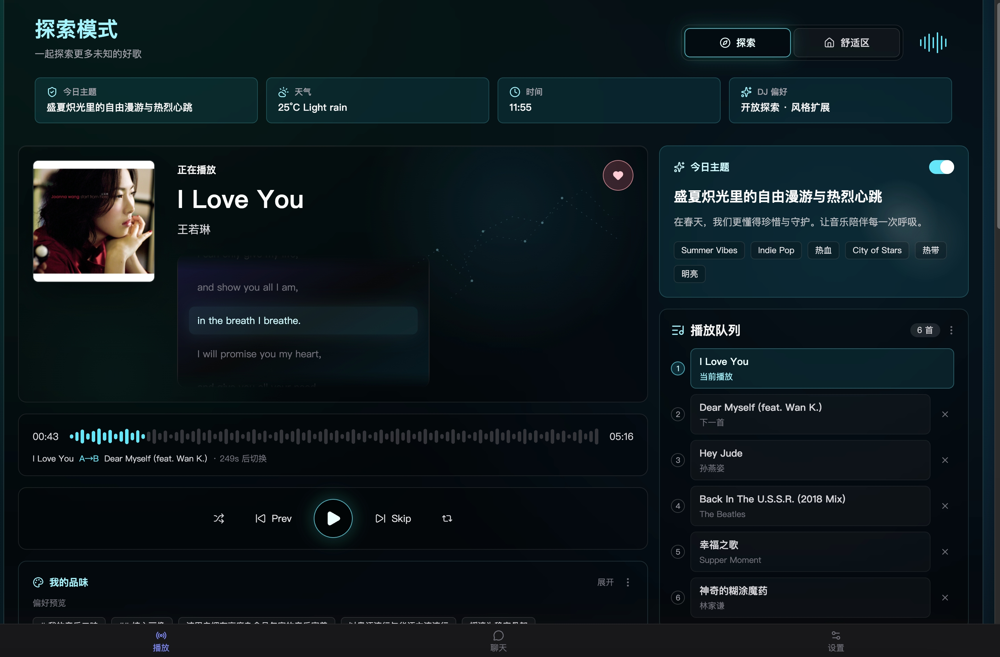

# Crossfadio

**你的私人 AI 电台 DJ。** 它不只是随机播放歌单——它懂你的品味，看天气、读时间、追每日主题，在合适的时刻用语音串场把两首歌无缝衔接，像一档只为你一个人直播的深夜电台。



## 为什么不一样

- **会说话的 DJ** — 歌曲切换前 12 秒，DJ 开始构思串场词：为什么是这首歌、此刻的天气、今天的主题。TTS 语音在音乐渐入时低声响起，随后完成一次等能量 crossfade + 低通滤波扫频的专业级过渡。
- **探索 / 舒适区双模式** — 想听点没听过的？探索模式把你的品味当作扩张种子，混合每日主题、时间、天气和 DJ 偏好往外推。想待在熟悉的声音里？舒适区模式把品味锚定得更紧。
- **每日主题电台** — 每天由 LLM 生成一个电台主题（节日、节气、艺人纪念日……），比如「盛夏炽光里的自由漫游与热烈心跳」，全天的选歌和串场都围绕它展开。可以一键开关。
- **聊着天换歌** — 直接对 DJ 说"来点更安静的"、"跳过这首"、"最近想听 City Pop"，自然语言即刻调整队列和短期偏好。
- **懂你的品味** — 从你的网易云红心歌单学习偏好画像，可选语义向量发现（embedding）挖掘风格相近的新歌。
- **专业播放引擎** — Web Audio 双 Deck 架构，A/B 轮流加载，歌词同步高亮，封面氛围底图，预取下一首零等待。

## 快速开始

```bash
pnpm install
pnpm dev        # 同时启动后端 + 前端
# 浏览器打开 http://127.0.0.1:5173
```

必需环境变量（OpenAI 兼容接口即可）：

| 变量 | 用途 |
|------|------|
| `CROSSFADIO_JWT_SECRET` | JWT 签名密钥（多用户必需） |
| `CROSSFADIO_LLM_BASE_URL` / `CROSSFADIO_LLM_API_KEY` / `CROSSFADIO_LLM_MODEL` | DJ 大脑 |
| `CROSSFADIO_TTS_PROVIDER` | TTS 供应商：`aliyun-qwen`（默认，需 `CROSSFADIO_TTS_BASE_URL` / `CROSSFADIO_TTS_API_KEY`）\| `openai-compatible`（同上）\| `tencent-cloud`（腾讯云语音合成 1073，需 `CROSSFADIO_TTS_SECRET_ID` / `CROSSFADIO_TTS_SECRET_KEY`） |

可选：`CROSSFADIO_TTS_VOICE_DEFAULT`（默认音色）、`CROSSFADIO_EMBEDDING_*`（语义发现，`CROSSFADIO_EMBEDDING_SEND_DIMENSIONS=0` 可适配不接受 dimensions 参数的模型）、`CROSSFADIO_ADMIN_NCM_ID`（白名单管理员）。

登录方式：网易云音乐**扫码登录**，曲库来自 NeteaseCloudMusicApi。

## 产品界面

- **播放** — 封面主卡 + 同步歌词 + 波形时间线 + 播放队列，右栏展示今日主题与上下文（天气 / 时间 / DJ 偏好）
- **聊天** — 与 DJ 对话，实时流式回复，支持取消
- **设置** — 网易云登录、TTS 音色、每日主题开关、探索模式、白名单管理（管理员）
- **移动端** — 768px 断点自适应单列布局，iPhone 安全区适配

## 多用户与部署

支持多人同时使用：JWT 认证、按用户隔离的 SQLite 数据、白名单准入（`allowlist.json` 或管理员 Web UI）。生产参数和完整运维手册仅保存在被 Git 忽略的本地文件中；公开边界见 [`docs/ops-runbook.md`](docs/ops-runbook.md)。本地配置齐全后可运行：

```bash
./scripts/deploy.sh
```

## 技术栈

TypeScript 全栈 · React 18 + Tailwind + zustand · Express + SSE 实时推送 · better-sqlite3 · Web Audio API · Zod 全链路校验

## 开发

```bash
pnpm dev:web       # 仅前端
pnpm dev:server    # 仅后端
pnpm check         # 类型检查（提交前必过）
pnpm test          # 全部测试
pnpm build && pnpm start   # 生产构建与启动
```

数据目录：macOS `~/Library/Application Support/Crossfadio` · Linux `~/.crossfadio` · Windows `%APPDATA%/Crossfadio`

更多配置项（NCM 子进程、歌词感知选歌、CORS 等）见 [`CLAUDE.md`](CLAUDE.md) 与 [`docs/ops-runbook.md`](docs/ops-runbook.md)。
