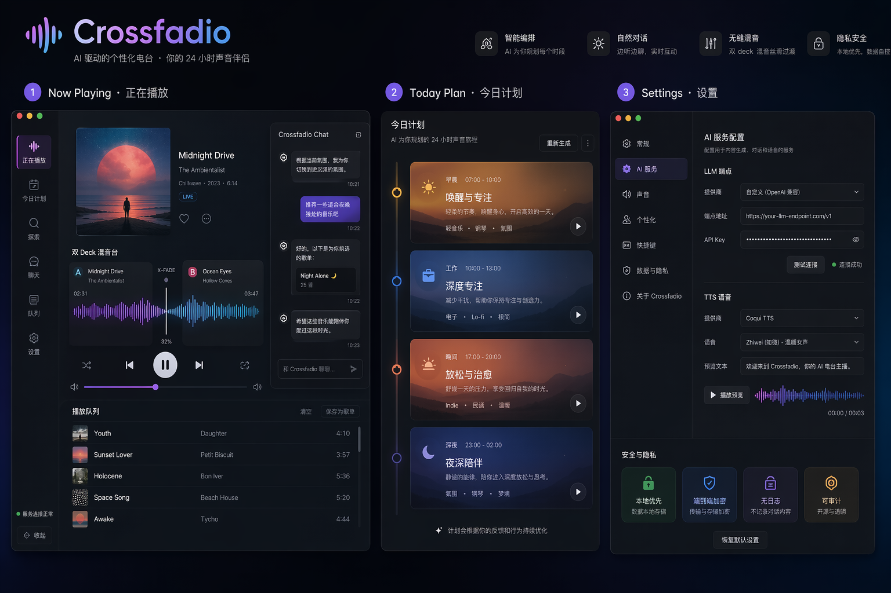
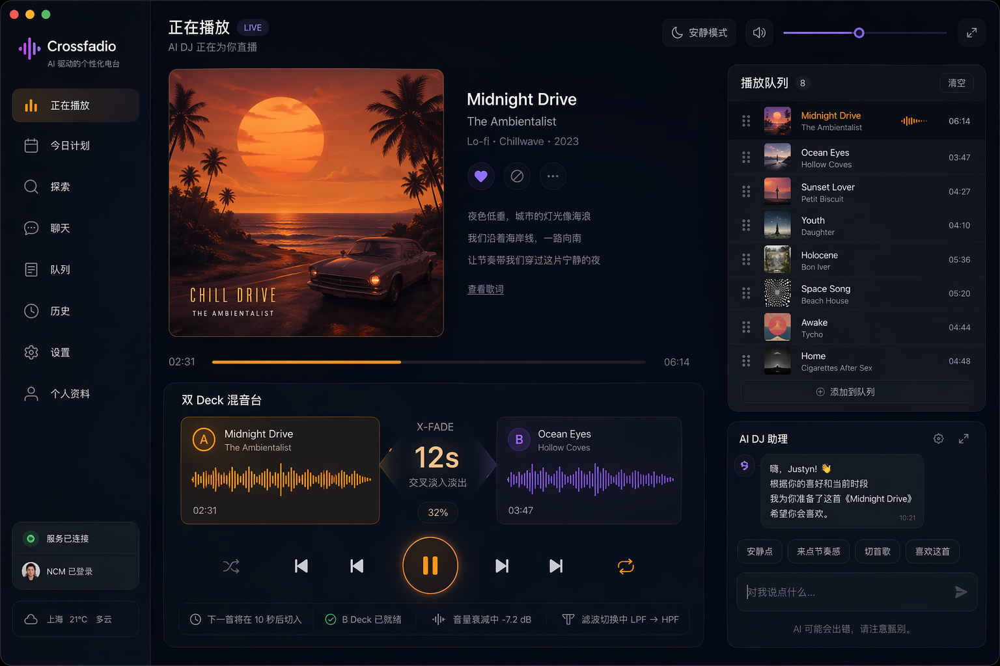
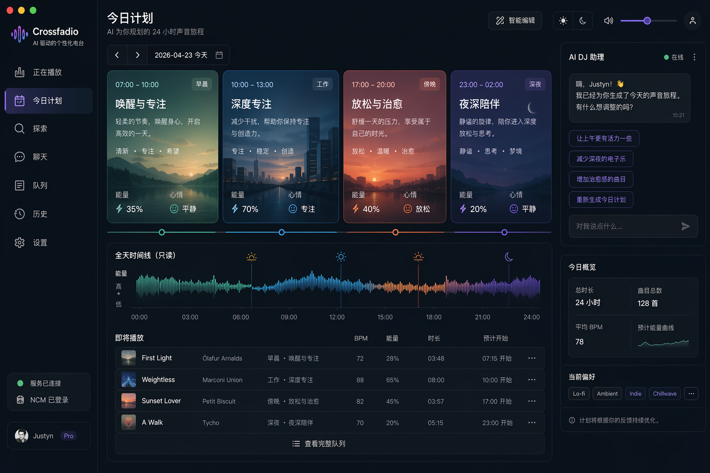
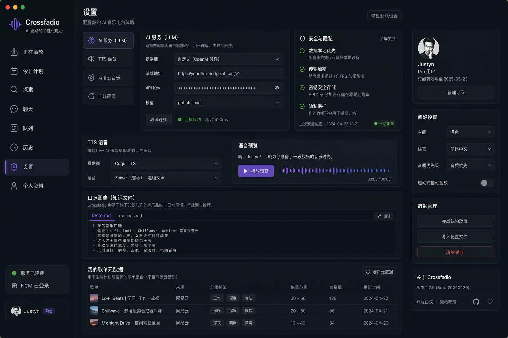

# Crossfadio UI 设计资产（Image 2）

- 产出日期: 2026-04-23
- 生成方式: Image 2
- 版本策略: `YYYY-MM-DD-<screen>-vN.png`

## 资产清单

1. `2026-04-23-board-v1.png`
- 用途: 三视图总览版（Player / Today Plan / Settings）

2. `2026-04-23-player-v1.png`
- 用途: 正在播放主界面（双 deck、队列、chat 入口）

3. `2026-04-23-plan-timeline-v1.png`
- 用途: 今日计划 + Timeline 只读可视化界面

4. `2026-04-23-settings-profile-v1.png`
- 用途: 设置与画像编辑界面（LLM/TTS/NCM/语料）

5. `2026-04-23-ui04-component-breakdown.md`
- 用途: UI-04 组件级细化稿（按钮/卡片/输入框/队列项）

6. `2026-04-23-ui07-design-to-component-mapping.md`
- 用途: UI-07 设计到代码映射清单（Design -> Component）

## 维护规则

1. 新增版本只追加，不覆盖历史图片。
2. 每次替换视觉方向时，至少更新一条“设计到代码映射”任务（见任务拆分文档 UI-07）。
3. 任何进入实现阶段的页面，必须在 PR 描述中引用对应设计文件名。

## 预览

