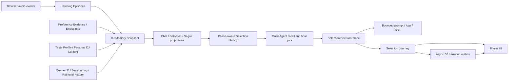

# DJ Memory 与 Selection Policy V2 大版本实施计划

> **执行约定：** 按任务顺序实施，每个任务先写失败测试、再实现、再跑定向测试。所有功能在同一个大版本中上线；线下分阶段验证，但线上不保留 v1 代码路径或 feature flag。

**目标：** 修复播放反馈失真、记忆来源分裂、排除规则失效、Selection Pressure 语义混乱、候选可播放性被来源覆盖、prompt JSON 截断、DJ Session Log 只写不读以及前后端 trace 契约漂移，并把透明、可读、可异步润色的 Selection Journey 做成默认产品体验。

**总体架构：** 浏览器以 Listening Episode 协议记录真实播放；服务端从权威存储构建单一 DJ Memory Snapshot；Phase-aware Selection Policy 分别处理 Admission、Recall、Ranking、Batch、Final；所有决策进入共享 Selection Decision Trace，再投影为 prompt、日志、SSE、Debug Trace 和用户可读 Selection Journey。

**技术栈：** TypeScript、React、Express、better-sqlite3、Zod、Vitest、Playwright、OpenAI-compatible LLM、SSE。

**依据：** [CONTEXT.md](../../../CONTEXT.md)、[ADR 0003](../../adr/0003-dj-session-log-for-continuity.md)、[ADR 0004](../../adr/0004-personal-dj-context-push-boundary.md)、[ADR 0005](../../adr/0005-explicit-music-requests-outrank-selection-pressure.md)、[ADR 0006](../../adr/0006-use-a-phase-aware-selection-policy.md)、[ADR 0007](../../adr/0007-use-a-unified-dj-memory-snapshot.md)、[ADR 0008](../../adr/0008-store-structured-preference-evidence.md)、[ADR 0009](../../adr/0009-use-one-versioned-selection-decision-trace.md)。

## 当前实施状态（2026-07-17）

- Task 0 的回滚分支、脱敏 replay 工具和安全护栏已完成；本次按发布约定只保留回滚分支，不创建 tag。
- Task 1-13 已实现，并由单元测试与 server-level 场景测试覆盖。
- Task 14 的离线 replay、legacy runtime 扫描、Playwright 浏览器 E2E、类型检查和生产构建已完成。
- 生产 SQLite/user corpus 快照、部署及线上 smoke test 属于实际发布步骤，当前工作树未执行。

---

## 已锁定的业务参数

| 领域 | 首版规则 |
| --- | --- |
| Early Skip | 用户主动跳过且 `positionMs < durationMs / 2`；正好 50% 不算，duration 未知不推断 |
| Track 升级 | 第一次软 pressure + 24h Temporary Queue Exclusion；60 天内第二次进入自主 recall suppression |
| Artist 升级 | 同一 primary artist 的 2 首不同歌曲 Early Skip 产生软 pressure；3 首进入自主 recall suppression；合作艺人不聚合 |
| 衰减 | 行为 evidence 使用 60 天窗口、21 天 half-life；保留现有 caps，首版不全面调参 |
| Exposure | completed=1；其余为 `listenedMs / durationMs`；duration 未知时按 240 秒参考长度计算且最多 0.5 |
| Legacy play | 一次性导入：completed=1.0，其他/null=0.25；绝不生成 Early Skip |
| Retrieval History | 策略窗口 14 天、原始记录 30 天；30 分钟去重，24 小时内软降序，24 小时内连续 2 次低收益则冷却 6 小时 |
| Listening Episode | 原始记录 90 天；open episode 24 小时无 checkpoint 后标记 interrupted |
| Personal DJ Context | 生成后最长 24 小时，可更早到期；过期删除 payload，不回退旧记录；只软影响 |
| DJ Session Log | 存储 30 天；运行时读取最近 24 小时、最多 20 条相关事件 |
| Selection Journey | 默认可见；完成记录 30 天，UI 回看最近 24 小时 |
| Debug Trace | 7 天 |
| 异步润色 | 持久化 outbox；24 小时内最多 5 次；不阻塞入队 |
| 发布 | 一个大版本全部启用；代码不保留 v1；回滚依靠基线分支和 additive schema |

## 不做的事情

- 不把 DJ Session Log 变成 event-sourcing source of truth。
- 不保存 chain-of-thought、raw prompt、聊天全文、Personal DJ Context 原文或歌词到 trace。
- 不保留 legacy LLM、random fallback、legacy discovery mode 或双选择引擎。
- 不在本版本删除旧数据库表；破坏性清理由稳定 90 天后的独立版本完成。
- 不在同一版本重调 popularity、title pollution、batch diversity 等全部数值。

## 目标调用链



---

## Task 0：建立回滚基线与 replay 安全护栏

**文件：**

- 新增 `scripts/export-dj-v2-replay.ts`
- 新增 `scripts/replay-dj-v2.ts`
- 新增 `tests/fixtures/dj-v2/README.md`
- 新增少量人工 fixture：`tests/fixtures/dj-v2/*.json`
- 修改 `.gitignore`
- 修改 `docs/ops-runbook.md`

**步骤：**

- [x] 在开始实现前，从当前稳定 commit 创建 `codex/rollback-pre-dj-memory-v2-<date>`；本次不创建 tag。
- [ ] replay exporter 只接受字段白名单；ID 使用一次性 salt 做一致 hash，时间平移，不允许 raw chat、PDC、prompt、歌词、cookie、token、URL 或原始日志正文进入输出。
- [ ] 本地 replay 默认目录加入 `.gitignore`；仓库只提交生成器、schema 与人工 fixture。
- [ ] 线上样本不足时，严格按 ops runbook 只读采样；在服务器侧完成脱敏后再传输。限制为最近 30 天、1,000 episodes、500 selection runs、1,000 retrieval attempts、2,000 policy cases。
- [ ] exporter 测试扫描所有 JSON key 与 string value，遇到禁止字段立即失败。

**定向测试：**

```bash
pnpm test -- tests/unit/dj-v2-replay.spec.ts
```

---

## Task 1：建立共享契约和 additive 数据库 schema

**新增共享契约：**

- `src/shared/listening.ts`
- `src/shared/selection.ts`
- `src/shared/dj-memory.ts`

**修改：**

- `src/shared/schema.ts`
- `src/server/store/migrations.ts`
- `src/server/store/db.ts`

**新增测试：**

- `tests/unit/listening-schema.spec.ts`
- `tests/unit/selection-decision-schema.spec.ts`
- `tests/unit/dj-memory-schema.spec.ts`
- `tests/unit/dj-v2-migrations.spec.ts`

**步骤：**

- [ ] `listening.ts` 定义幂等 create/checkpoint/finalize wire schema、`checkpointSeq` 和 `completed/skipped/failed/interrupted` outcome。
- [ ] `selection.ts` 定义版本化 Trace 与 Journey：`stage`、`action`、稳定 `reasonCode`、provenance、bounded evidence refs、公开 Journey snapshot 和 SSE event。
- [ ] `dj-memory.ts` 定义 Snapshot source/freshness metadata 及 chat/selection/segue 三种 projection。
- [ ] 新增 `listening_episodes`，唯一键 `(user_id, client_episode_id)`；包含 player/deck、track identity、duration/position/listened、checkpoint、outcome、protocol version、legacy exposure override。
- [ ] 新增 `preference_evidence`、`preference_extraction_batches`、`explicit_exclusions`、`taste_profiles`、`retrieval_attempts`、`dj_configuration_entries`。
- [ ] 新增 `selection_debug_traces`、`selection_journeys`、`selection_narration_outbox`。
- [ ] 为 `personal_dj_contexts` 增加 `generated_at`、`expires_at`；为 `dj_events` 增加全局时间清理索引。
- [ ] 所有迁移只新增表、列和索引；旧 `plays`、`chat_preferences`、`music_query_stats` 及旧 corpus 文件暂不删除，保证回滚分支能启动。
- [ ] 新增幂等 TypeScript data migration runner。它只在 schema migration 后执行，不形成运行时 v1 分支。

**关键索引：**

- `listening_episodes(user_id, started_at DESC)`、`(user_id, track_id, started_at DESC)`、open episode partial index。
- `preference_evidence(user_id, subject_type, subject_key, observed_at DESC)`。
- `explicit_exclusions(user_id, entity_type, entity_key, revoked_at)`。
- `retrieval_attempts(user_id, source, normalized_query, attempted_at DESC)`。
- outbox 的 `(status, next_attempt_at)` 与所有 retention cutoff 索引。

**定向测试：**

```bash
pnpm test -- tests/unit/listening-schema.spec.ts tests/unit/selection-decision-schema.spec.ts tests/unit/dj-memory-schema.spec.ts tests/unit/dj-v2-migrations.spec.ts
```

---

## Task 2：实现 Listening Episode 服务端协议并停用旧 plays API

**新增：**

- `src/server/store/listening-episodes.ts`
- `src/server/listening/listening-signals.ts`
- `src/server/http/routes/listening-episodes.ts`

**修改：**

- `src/server/http/routes/now-next.ts`
- `src/server/http/index.ts`
- `src/server/music-agent/entity-indexer.ts`

**删除：**

- `src/server/http/routes/plays.ts`
- `src/server/store/plays.ts`
- `tests/unit/plays-routes.spec.ts`
- `tests/unit/plays.spec.ts`

**新增测试：**

- `tests/unit/listening-signals.spec.ts`
- `tests/unit/listening-episodes-store.spec.ts`
- `tests/unit/listening-episodes-routes.spec.ts`
- `tests/unit/listening-episode-migration.spec.ts`

**步骤：**

- [ ] `PUT /api/listening-episodes/:clientEpisodeId` 幂等创建；首次创建才触发 `indexPlayedTrack`。
- [ ] `PATCH` 接受 checkpoint 或 terminal outcome；忽略旧 `checkpointSeq`，重复 finalize 幂等，不同 terminal outcome 返回冲突。
- [ ] 服务端校验 listenedMs 单调、非负、没有明显超过两次 checkpoint 的墙钟间隔；允许 seek 导致 position 倒退。
- [ ] `/api/now` 只解析媒体，删除响应后的 `startPlay()`，并移除 name/artist query 兼容参数。
- [ ] data migration 把最近 90 天旧 plays 一次性写为 `protocol_version=0` episode：completed exposure override=1.0，其余/null=0.25；永不产生 Early Skip。
- [ ] v2 运行时不再读写 `plays`，也不双写。旧表仅供回滚分支使用，90 天后由独立 cleanup 版本删除。
- [ ] `listening-signals.ts` 实现 Early Skip、Exposure 和未知 duration fallback；failed/interrupted 只贡献 Exposure。

**必测边界：** 49.9%/50%、未知 duration、乱序 checkpoint、重复 PUT/finalize、用户隔离、旧数据不生成负反馈。

**定向测试：**

```bash
pnpm test -- tests/unit/listening-signals.spec.ts tests/unit/listening-episodes-store.spec.ts tests/unit/listening-episodes-routes.spec.ts tests/unit/listening-episode-migration.spec.ts tests/unit/now-next.spec.ts
```

---

## Task 3：在播放器接入真实播放状态机

**新增：**

- `src/renderer/playerListeningEpisode.ts`
- `tests/unit/player-listening-episode.spec.ts`

**修改：**

- `src/renderer/api.ts`
- `src/renderer/views/Player/PlayerView.tsx`
- `src/renderer/playerMediaRuntime.ts`
- `tests/unit/player-layout.spec.ts`
- `tests/unit/player-media-runtime.spec.ts`

**步骤：**

- [ ] 每个标签页在 `sessionStorage` 持有独立 `playerInstanceId`；每次真实曲目尝试生成 `clientEpisodeId`。
- [ ] 仅在原生 `playing` 事件创建 episode；`play`、URL 请求、prefetch、stream refresh 都不能创建记录。
- [ ] 用 `performance.now()` 累计真正 playing 的时间；pause、waiting、stalled、seeking 阶段暂停累计，`timeupdate` 只更新 position。
- [ ] 每 15 秒以及 pause、seek、pagehide、切歌时 checkpoint；pagehide 使用带认证的 `fetch(..., { keepalive: true })`。
- [ ] `onEnded` 先 finalize completed 再推进队列；手动下一首、上一首、点击其他歌曲在队列变化前 finalize skipped。
- [ ] 媒体错误重试沿用同一 episode；只有重试耗尽才 failed；远端替换当前曲目、登出或卸载为 interrupted。
- [ ] 网络响应带 generation，旧请求不得关闭或更新新曲目的 episode。
- [ ] 只关闭实际播放的当前曲目；队列操作批量移除的未播放歌曲不能产生 skipped。

**定向测试：**

```bash
pnpm test -- tests/unit/player-listening-episode.spec.ts tests/unit/player-layout.spec.ts tests/unit/player-media-runtime.spec.ts
```

---

## Task 4：结构化 Preference Evidence 与 Explicit Exclusion

**新增：**

- `src/server/store/preference-evidence.ts`
- `src/server/store/preference-extraction-batches.ts`
- `src/server/store/explicit-exclusions.ts`
- `src/server/music-agent/selection-intent.ts`

**修改：**

- `src/server/music-agent/memory.ts`
- `src/server/store/messages.ts`
- `src/server/agent/schema.ts`
- `src/server/agent/modes.ts`
- `src/server/agent/actions.ts`
- `src/server/http/chat-sse-worker.ts`

**删除：**

- `src/server/store/chat-preferences.ts`

**新增测试：**

- `tests/unit/preference-evidence-store.spec.ts`
- `tests/unit/preference-extraction.spec.ts`
- `tests/unit/explicit-exclusions-store.spec.ts`
- `tests/unit/selection-intent.spec.ts`

**步骤：**

- [ ] extraction 输出结构化 subject/type/polarity/strength/confidence/source refs；合法 evidence 与合法 no-evidence 才完成批次。
- [ ] timeout、malformed、schema mismatch 进入 retryable，保存 attempts、nextAttemptAt、errorCode 和 extractor version；不得永久标记消息已抽取。
- [ ] Expressed Preference 无硬过期，可被相反明确陈述 supersede；Inferred Preference 使用 60 天窗口与 21 天 half-life，同向 evidence 加强但封顶。
- [ ] 时境表达路由到 Active Directive；“不喜欢”仍是软 evidence；“不要再放/屏蔽”才创建 Explicit Exclusion。
- [ ] `explicit_exclusions` 保存 track/artist、规范化 key、provider ID、来源和 revokedAt；新增明确撤销 action。
- [ ] “还是放周杰伦吧”先撤销匹配 exclusion，再形成 Explicit Music Request；普通泛化请求不撤销。
- [ ] 一次性迁移 `ban.artist.* / ban.track.*` prefs；v2 不再读取旧 key。
- [ ] 一次性重新处理仍可定位 source messages 的旧 chat preference；找不到原消息时只导入 60 天后过期的 low-confidence `legacy_summary`。

**定向测试：**

```bash
pnpm test -- tests/unit/preference-evidence-store.spec.ts tests/unit/preference-extraction.spec.ts tests/unit/explicit-exclusions-store.spec.ts tests/unit/selection-intent.spec.ts tests/unit/music-agent-memory.spec.ts
```

---

## Task 5：修复 Personal DJ Context、Taste Profile 与 legacy corpus

**新增：**

- `src/server/store/taste-profiles.ts`
- `src/server/store/dj-configuration.ts`
- `src/server/user-corpus/legacy-migration.ts`

**修改：**

- `src/server/store/personal-dj-context.ts`
- `src/server/http/routes/personal-dj-context.ts`
- `src/server/http/routes/taste-analysis.ts`
- `src/server/http/routes/settings.ts`
- `src/server/ncm/auth.ts`
- `src/server/user-corpus/bootstrap.ts`
- `skills/crossfadio-personal-dj-context/scripts/build_personal_dj_context.py`
- `skills/crossfadio-personal-dj-context/scripts/upload_personal_dj_context.py`

**删除或移出 bootstrap：**

- `user-template/taste.md`
- `user-template/routines.md`
- `user-template/mood-rules.md`

**新增测试：**

- `tests/unit/taste-profiles-store.spec.ts`
- `tests/unit/legacy-corpus-migration.spec.ts`
- 更新 `tests/unit/personal-dj-context-store.spec.ts`
- 更新 `tests/unit/personal-dj-context-routes.spec.ts`
- 更新 `tests/unit/personal-dj-context-skill.spec.ts`
- 更新 `tests/unit/settings-routes.spec.ts`

**步骤：**

- [ ] PDC schema 支持可选 `validUntil`；以 `generatedAt` 计算 `min(validUntil, generatedAt + 24h)`，拒绝已经过期或比服务端时间晚 5 分钟以上的上传。
- [ ] current 只返回仍有效的最新记录；过期删除 payload/整行，不回退；DJ Event 仅保留 contextId、时间、source kind 和 hint count。
- [ ] taste analysis 写版本化 Taste Profile，不再写 `taste.md`；liked-library profile 是软画像，不是 Expressed Preference。
- [ ] 新用户只初始化 persona 与非个人 playlist 配置，不复制示例 taste/routine/mood rule。
- [ ] legacy migration 比较规范化内容 hash：未改默认模板完全忽略；自定义 taste 导入 `legacy_taste_md` Profile；自定义 routines/mood rules 导入 `legacy_user_config`。
- [ ] persona/playlists 进入 DJ Configuration；旧文件不删除，供回滚分支使用；v2 runtime 不再直接读取自由文本 corpus。

**定向测试：**

```bash
pnpm test -- tests/unit/taste-profiles-store.spec.ts tests/unit/legacy-corpus-migration.spec.ts tests/unit/personal-dj-context-store.spec.ts tests/unit/personal-dj-context-routes.spec.ts tests/unit/personal-dj-context-skill.spec.ts tests/unit/settings-routes.spec.ts
```

---

## Task 6：用 append-only Retrieval History 替换永久累计 stats

**新增：**

- `src/server/store/retrieval-history.ts`
- `src/server/music-agent/retrieval-policy.ts`
- `tests/unit/retrieval-history.spec.ts`

**修改：**

- `src/server/music-agent/query-recall.ts`
- `src/server/music-agent/query-funnel.ts`
- `src/server/music-agent/query-planning.ts`
- `src/server/music-agent/web-discovery-run.ts`

**删除：**

- `src/server/store/music-query-stats.ts`
- `src/server/music-agent/query-stats.ts`
- `tests/unit/music-agent-query-stats.spec.ts`

**步骤：**

- [ ] 每次 attempt 记录 runId、source、request kind、query、searched/result/added/selected 和 attemptedAt。
- [ ] 自主查询 30 分钟内去重；30 分钟至 24 小时软降序；24 小时内连续两次低收益则冷却 6 小时；最终入选会清除低收益 streak。
- [ ] Explicit Music Request 完全绕过 repeat、quality reweight 与 cooldown，但同一 run 内仍做幂等去重。
- [ ] 所有 proposed queries 都冷却时返回 `alternative_query_required`，要求生成替代查询；禁止像现在一样重新放行全部 cooled queries。
- [ ] 策略只读 14 天；原始 attempt 30 天清理。旧永久 aggregate 不导入策略，避免把历史累计继续固化。

**定向测试：**

```bash
pnpm test -- tests/unit/retrieval-history.spec.ts tests/unit/music-agent-query-recall.spec.ts tests/unit/music-agent-query-funnel.spec.ts
```

---

## Task 7：建立唯一 DJ Memory Snapshot 和用途投影

**新增：**

- `src/server/dj-memory/schema.ts`
- `src/server/dj-memory/snapshot.ts`
- `src/server/dj-memory/projections.ts`
- `src/server/dj-memory/session-continuity.ts`

**修改：**

- `src/server/store/dj-events.ts`
- `src/server/agent/schema.ts`
- `src/server/agent/fragments.ts`
- `src/server/dj-agent/index.ts`
- `src/server/dj-agent/events.ts`

**删除：**

- `src/server/dj-agent/context.ts`
- `src/server/music-agent/context.ts`
- `src/server/user-corpus/loader.ts`（所有消费者完成迁移后）

**新增测试：**

- `tests/unit/dj-memory-snapshot.spec.ts`
- `tests/unit/dj-memory-projections.spec.ts`
- `tests/unit/dj-session-continuity.spec.ts`
- `tests/integration/dj-memory-consumers.spec.ts`

**步骤：**

- [ ] 一次 Snapshot 并行加载 queue/currentIndex、当前/open 和近期 episodes、Preference Evidence、Taste Profile、Active Directive、Explicit/Temporary Exclusion、PDC、DJ Configuration、24h DJ events、当前时刻与天气。
- [ ] 明确 currentTrack 与 upcoming queue；upcoming 从 `currentIndex + 1` 开始。当前曲目只进入 transition/batch context，不能再误当作队首 future penalty。
- [ ] `projectForChat/Selection/Segue` 各自白名单和预算；Snapshot 保存结构化值，不保存 prompt 文本。
- [ ] DJ Session Log 只产生 continuity：selection 看请求摘要/选择理由，segue 看选择理由/近期串词，chat 看请求/指令/队列动作；最多 20 条、24 小时外为空。
- [ ] 权威队列、episode、directive、exclusion 总是覆盖 event；PDC 只进入软 contextFit、检索方向和语气。
- [ ] chat 保存当前消息后构建一次 Snapshot，chat response 与 recommend 共用；segue 的歌词/wiki enrichment 可并行，但天气/PDC 只能来自 Snapshot。
- [ ] 更新/删除旧 Fragments 的自由文本 corpus/memory 字段，防止第二套上下文入口复活。

**定向测试：**

```bash
pnpm test -- tests/unit/dj-memory-snapshot.spec.ts tests/unit/dj-memory-projections.spec.ts tests/unit/dj-session-continuity.spec.ts tests/integration/dj-memory-consumers.spec.ts tests/unit/agent-fragments.spec.ts
```

---

## Task 8：实现 Phase-aware Selection Policy 与 Selection Pressure

**新增：**

- `src/server/music-agent/selection-policy/model.ts`
- `src/server/music-agent/selection-policy/admission.ts`
- `src/server/music-agent/selection-policy/recall.ts`
- `src/server/music-agent/selection-policy/ranking.ts`
- `src/server/music-agent/selection-policy/batch.ts`
- `src/server/music-agent/selection-policy/final.ts`
- `src/server/music-agent/selection-policy/trace.ts`
- `src/server/music-agent/selection-policy/index.ts`

**修改：**

- `src/server/music-agent/schema.ts`
- `src/server/music-agent/tools.ts`
- `src/server/music-agent/rank.ts`
- `src/server/music-agent/loop.ts`
- `src/server/music-agent/index.ts`

**新增测试：**

- `tests/unit/selection-policy-precedence.spec.ts`
- `tests/unit/selection-pressure.spec.ts`
- `tests/unit/selection-policy-batch.spec.ts`

**步骤：**

- [ ] 固定优先级：客观不可播放/身份 → 未撤销 Explicit Exclusion → 当前 Explicit Music Request → Active Directive → fresh PDC/Expressed Preference 的各自维度 → Inferred Preference → Exposure/Batch/Retrieval → Trend。
- [ ] 阶段分别返回 decision/action/reason code；不再跨阶段维护一个 universal penalty。
- [ ] `MusicCandidateScores` 只保留正向匹配分量；删除 `recentPenalty/skipPenalty`，所有负向影响改为带来源的 Pressure contribution。
- [ ] Admission 只做身份、Playback Eligibility 和 Explicit Exclusion；Recall 只在 autonomous mode 做 suppression；Ranking 返回独立 pressure contributions；Batch 做主艺人/来源/标题 motif 多样性；Final 重验硬门和 queue idempotency。
- [ ] 删除 `penalty >= 0.18 => avoidArtists`、`avoidArtists` 隐式硬过滤和 LLM prompt 中“高 penalty 必须 avoid”的规则。
- [ ] Explicit Request 可绕过 Exposure、Early Skip pressure、Temporary Queue Exclusion 和 Retrieval cooldown；不可绕过 Explicit Exclusion、Playback Eligibility 或已播放/已在队列幂等。
- [ ] Exposure 贡献保留现有 60 天/21 天/caps；queue positional weights 首版不调，但只作用于 upcoming queue。
- [ ] Early Skip 使用衰减后的有效计数：新鲜 2 次 track 或 3 个 distinct primary-artist tracks 达到 suppression，衰减后自动退回软 pressure。
- [ ] deterministic recovery 也必须调用同一 Policy，不允许出现绕过 hard gate 的 fallback。

**定向测试：**

```bash
pnpm test -- tests/unit/selection-policy-precedence.spec.ts tests/unit/selection-pressure.spec.ts tests/unit/selection-policy-batch.spec.ts tests/unit/music-agent-rank.spec.ts tests/unit/music-agent-loop.spec.ts
```

---

## Task 9：拆分 Playback Eligibility 与 Candidate Quality

**新增：**

- `src/server/music-agent/playback-eligibility.ts`
- `src/server/music-agent/candidate-quality.ts`

**修改：**

- `src/server/music-agent/candidates.ts`
- `src/server/music-agent/candidate-admission.ts`
- `src/server/music-agent/selection-eligibility.ts`
- `src/server/music-agent/rank.ts`
- `src/server/music-agent/loop.ts`

**新增测试：**

- `tests/unit/playback-eligibility.spec.ts`
- `tests/unit/music-agent-candidate-facts.spec.ts`
- 更新 `tests/unit/music-agent-candidates.spec.ts`
- 更新 `tests/unit/music-agent-selection-eligibility.spec.ts`

**步骤：**

- [ ] `copyright === 0`、`privilegeSt < 0`、`privilegeToast === true`、无效 track identity 为 source-independent hard rejection。
- [ ] popularity、title pollution、metadata completeness、`noCopyrightRcmd` 为软质量信号。
- [ ] candidate merge 时 provenance 只增不减；任何来源发现的客观不可播放事实不能被 liked 覆盖；冲突事实保留 source/fetchedAt 供 trace。
- [ ] liked 只表达 taste evidence，不再作为“质量可信”正向信号，也不能关闭 hard filter。
- [ ] Explicit Request/liked 可绕过软质量 pressure，但 Final 必须再次校验 Playback Eligibility。
- [ ] 删除 `usesExternalQuality()` 对 hard eligibility 的控制，并修复 renderer 依赖其副作用的测试。

**定向测试：**

```bash
pnpm test -- tests/unit/playback-eligibility.spec.ts tests/unit/music-agent-candidate-facts.spec.ts tests/unit/music-agent-candidates.spec.ts tests/unit/music-agent-selection-eligibility.spec.ts tests/unit/music-agent-rank.spec.ts
```

---

## Task 10：统一所有消费者并删除 legacy selection

**修改：**

- `src/server/dj-agent/index.ts`
- `src/server/dj-agent/segue.ts`
- `src/server/http/chat-sse-worker.ts`
- `src/server/http/routes/djNext.ts`
- `src/server/dj/pickNextRun.ts`
- `src/server/dj/musicAgentPickNextResult.ts`
- `src/server/dj/pickNextTelemetry.ts`
- `src/shared/dj.ts`
- `src/server/http/routes/settings.ts`
- `src/renderer/views/Player/PlayerView.tsx`
- `src/renderer/components/player/QueuePanel.tsx`

**删除：**

- `src/server/dj/legacyCandidatePool.ts`
- `src/server/dj/legacyLikedSample.ts`
- `src/server/dj/legacyPickNextResult.ts`
- `src/server/dj/legacyPickPrompt.ts`
- `src/server/dj/legacyRandomFallback.ts`
- `src/server/dj/legacyStyleDiscovery.ts`
- `src/server/dj/legacyStylePrompt.ts`
- 对应七个 `tests/unit/dj-legacy-*.spec.ts`

**新增/重写测试：**

- `tests/unit/dj-v2-pick-next.spec.ts`
- `tests/unit/chat-v2-recommend.spec.ts`
- 重写 `tests/unit/dj-next.spec.ts` 中源码字符串断言为行为测试
- 更新 `tests/unit/dj-agent-pick-next.spec.ts`
- 更新 `tests/unit/dj-agent-segue.spec.ts`
- 更新 `tests/unit/chat-dj-events.spec.ts`

**步骤：**

- [ ] auto-fill、chat recommend、segue 全部从同一 Snapshot projection 进入 DJAgent/MusicAgent。
- [ ] `pickNextRun.ts` 只保留 v2 orchestration、timeout、queue apply 和 Policy-governed deterministic recovery。
- [ ] 删除 `legacy-fallback` status、random liked fallback、legacy chat recommend、legacy telemetry path。
- [ ] `DiscoveryMode` 运行时只保留 `explore | comfort`；读取边界把旧 pref 值 `legacy` 规范化为 `explore`，但不改写存储值，以便回滚分支继续读取；删除设置页和播放器 Legacy 按钮/文案。
- [ ] MusicAgent 缺配置、超时、非法 picks 时只能用已验证候选做 v2 deterministic recovery；没有合格候选则明确 no-selection，不能随机塞歌。
- [ ] Final queue apply 再校验 hard gates 和 idempotency，并记录 skipped reason codes。
- [ ] 确认代码搜索不存在 `legacy_llm_success`、`legacy_random_fallback`、`music_agent_legacy_fallback` 或 `discoveryMode === 'legacy'`。

**定向测试：**

```bash
pnpm test -- tests/unit/dj-v2-pick-next.spec.ts tests/unit/chat-v2-recommend.spec.ts tests/unit/dj-next.spec.ts tests/unit/dj-agent-pick-next.spec.ts tests/unit/dj-agent-segue.spec.ts tests/unit/chat-dj-events.spec.ts
```

---

## Task 11：统一 Selection Decision Trace、prompt、日志和 SSE 契约

**新增：**

- `src/server/music-agent/prompt-projection.ts`
- `src/server/dj/selection-trace-projections.ts`
- `src/server/store/selection-debug-traces.ts`

**修改：**

- `src/server/music-agent/prompts.ts`
- `src/server/music-agent/loop.ts`
- `src/server/dj/musicAgentPickNextResult.ts`
- `src/server/dj/pickNextTelemetry.ts`
- `src/renderer/playerSseEvents.ts`

**新增测试：**

- `tests/unit/selection-decision-trace.spec.ts`
- `tests/unit/music-agent-prompt-projection.spec.ts`
- 更新 `tests/unit/music-agent-prompts.spec.ts`
- 更新 `tests/unit/player-sse-events.spec.ts`

**步骤：**

- [ ] 所有阶段通过一个 trace collector 写稳定 reason codes；禁止消费者自行拼另一套 candidate score/debug contract。
- [ ] prompt projection 输入结构化对象，先按优先级删除低价值数组项/可选字段、再裁剪 string、最后 `JSON.stringify`；绝不截断序列化后的 JSON。
- [ ] candidate summary、context、observations、selection notes 全部改为结构化输入；每次输出断言长度上限且 `JSON.parse()` 成功。
- [ ] 常规 pino 只记 runId、阶段计数、最终 reason codes、耗时与异常摘要；完整脱敏 Debug Trace 保存 7 天。
- [ ] renderer 删除本地 `CandidateScoreTableRow` 和手写字段映射，直接 parse shared schema，确保 provenance/quality 字段不再丢失。
- [ ] property/fuzz 覆盖长 Unicode、转义、深层对象、大数组和极小预算。

**定向测试：**

```bash
pnpm test -- tests/unit/selection-decision-trace.spec.ts tests/unit/music-agent-prompt-projection.spec.ts tests/unit/music-agent-prompts.spec.ts tests/unit/player-sse-events.spec.ts
```

---

## Task 12：把 Selection Journey 做成默认、实时、可回看的播放器体验

**新增：**

- `src/server/dj/selection-journey.ts`
- `src/server/store/selection-journeys.ts`
- `src/server/http/routes/selection-journeys.ts`
- `src/renderer/playerSelectionJourney.ts`
- `src/renderer/components/player/SelectionJourneyCard.tsx`

**修改：**

- `src/server/dj-agent/index.ts`
- `src/server/dj-agent/events.ts`
- `src/server/http/routes/djNext.ts`
- `src/server/http/routes/sse-events.ts`
- `src/server/http/broadcast.ts`
- `src/server/http/index.ts`
- `src/renderer/sse/client.ts`
- `src/renderer/playerDjPickNextStream.ts`
- `src/renderer/views/Player/PlayerView.tsx`

**删除：**

- `src/renderer/playerDjPickLog.ts`（Journey 完整替代后）

**新增测试：**

- `tests/unit/selection-journey.spec.ts`
- `tests/unit/selection-journeys-store.spec.ts`
- `tests/unit/selection-journey-routes.spec.ts`
- `tests/unit/player-selection-journey.spec.ts`

**步骤：**

- [ ] run 开始、理解、召回、筛选、搭配、完成时生成完整幂等 snapshot，而不是依赖 delta patch；使用 runId/version/revision 去重。
- [ ] Journey 文案由 reason-code 模板生成，不把软证据写成“你不喜欢”，不泄漏 PDC 原文、内部数值或 chain-of-thought。
- [ ] 即时 Journey 持久化 30 天；history API 默认只返回最近 24 小时。
- [ ] `SelectionJourneyCard` 替换 DjStatusDock 的日志体验：桌面在队列前，移动端在控制区下方；首次展开，尊重用户折叠状态。
- [ ] 折叠时仍显示一句实时状态；展开最多 5 个关键阶段、8 个候选摘要、最终选择理由和 DJ 手记。
- [ ] direct pick-next stream 与 persistent SSE 可能重复到达，reducer 必须幂等；异步手记更新不弹窗、不抢焦点。

**定向测试：**

```bash
pnpm test -- tests/unit/selection-journey.spec.ts tests/unit/selection-journeys-store.spec.ts tests/unit/selection-journey-routes.spec.ts tests/unit/player-selection-journey.spec.ts tests/unit/player-layout.spec.ts
```

---

## Task 13：实现必备的异步 DJ 手记润色与统一 retention

**新增：**

- `src/server/store/selection-narration-outbox.ts`
- `src/server/dj/selection-journey-narrator.ts`
- `src/server/jobs/selection-journey-narration-worker.ts`
- `src/server/maintenance/retention.ts`

**修改：**

- `src/server/dj-agent/index.ts`
- `src/server/index.ts`
- `src/server/http/routes/sse-events.ts`

**新增测试：**

- `tests/unit/selection-narration-outbox.spec.ts`
- `tests/unit/selection-journey-narrator.spec.ts`
- `tests/unit/selection-narration-worker.spec.ts`
- `tests/unit/retention-maintenance.spec.ts`

**步骤：**

- [ ] 完成即时 Journey 与入队后，以 `runId + journeyVersion + factsHash` 幂等写 outbox；播放不等待润色。
- [ ] 尝试计划固定为立即、1 分钟、5 分钟、30 分钟、6 小时；24 小时后不再发布过时结果。
- [ ] worker 使用 lease，服务重启后恢复；旧 journeyVersion/factsHash 的结果不能覆盖新版。
- [ ] 输入仅含公开 Journey facts、DJ persona 和允许公开的 tone tag；实体必须来自 whitelist，reason facts 必须存在于 Trace。
- [ ] 低优先级 narration 可被 pick-next/segue 前台 LLM 工作抢占；失败始终保留确定性 Journey。
- [ ] 成功后更新 Journey、保存 polished 版本并广播同一个 shared snapshot event。
- [ ] retention 启动即跑并周期执行：stale open episode 24h、episodes 90d、PDC expiry、DJ events/Journey 30d、Retrieval 30d、Debug Trace 7d、过期 Inferred Evidence。
- [ ] timer `unref()`；shutdown 先停止 worker/maintenance 再关闭 DB。

**定向测试：**

```bash
pnpm test -- tests/unit/selection-narration-outbox.spec.ts tests/unit/selection-journey-narrator.spec.ts tests/unit/selection-narration-worker.spec.ts tests/unit/retention-maintenance.spec.ts
```

---

## Task 14：完整验证、浏览器 E2E 与一次性大版本发布

**新增：**

- `playwright.config.ts`
- `tests/e2e/listening-episode.spec.ts`
- `tests/e2e/selection-journey.spec.ts`
- `tests/fixtures/audio/short-tone.*`

**修改：**

- `package.json`
- `pnpm-lock.yaml`
- `scripts/deploy.sh`（仅在需要加入 preflight 时）
- `docs/ops-runbook.md`

**步骤：**

- [ ] 加入 Playwright 与 `test:e2e`；route interception 提供确定性 queue、now、episode、pick-next 和 narration 响应，避免正式门禁依赖 NCM 波动。
- [ ] E2E 覆盖真实 audio event：开始、pause/resume、半程前跳过、50% 后跳过、自动补歌、Journey 实时阶段、入队、异步手记、刷新后历史回看。
- [ ] 用人工 fixture 与本地脱敏 replay 运行完整 Policy；数据不足时按 Task 0 边界从线上补样。
- [ ] replay 硬断言：Playback Eligibility/Explicit Exclusion 违规=0；自动补歌成功率不低于基线；同步 p95 回归不超过 15%；prompt JSON 合法率=100%。
- [ ] narration 模拟门禁：即时 Journey=100%，24h 内最终成功率模型至少达到 98%；失败路径不影响入队。
- [ ] 搜索确认没有 legacy runtime：

```bash
rg -n "legacy_(llm|random|chat)|music_agent_legacy_fallback|discoveryMode === 'legacy'" src
```

预期：无匹配。与数据库迁移、测试 fixture 或文档相关的 `legacy` 必须人工确认不是运行时选择分支。

- [ ] 完整质量门禁：

```bash
pnpm check
pnpm test
pnpm test:e2e
pnpm build
git diff --check
```

- [ ] 发布前创建 SQLite 和 user corpus 快照，并验证 rollback 分支在升级后的 additive schema 上能启动和读取旧数据。
- [ ] 同一次部署默认启用全部 v2 能力；不做线上 feature flag 或 cohort rollout。
- [ ] 部署后按 ops runbook 验证 ECS 本机与公网 `/api/health`，再用真实浏览器完成一次实际播放、Early Skip、自动补歌、Journey 和异步手记 smoke test。
- [ ] 严重事故时部署回滚分支；通常不恢复数据库，避免丢失 v2 新数据。回滚分支看不到 v2 期间的新 episode 是已接受的代价。
- [ ] 稳定 90 天后另开 cleanup 版本删除旧表、旧文件 migration helper 和回滚分支依赖。

---

## 问题覆盖检查表

| 当前问题 | 解决任务 |
| --- | --- |
| `/api/now` 把 URL 请求记成播放，renderer 不结束 play | Task 2-3 |
| `end_reason/skipPenalty` 实际失效 | Task 2、8 |
| queue summary/penalty 忽略 currentIndex | Task 7-8 |
| `compactJson()` 截出非法 JSON | Task 11 |
| renderer 丢 provenance/quality 字段 | Task 11 |
| `ban_artist/ban_track` 写入但 MusicAgent 不读取 | Task 4、8 |
| penalty >= 0.18 被升级成无条件 avoid | Task 8 |
| candidate 合并 liked 后关闭 hard quality filter | Task 9 |
| Query History 永久累计、按查询顺序冷却 | Task 6 |
| malformed preference extraction 被永久标完成 | Task 4 |
| Personal DJ Context 最新一条永久有效 | Task 5 |
| 默认 corpus 模板伪造个人事实 | Task 5 |
| chat/selection/segue 重复拼上下文和天气 | Task 7、10 |
| DJ Session Log 只写不读 | Task 7 |
| legacy picker 与 MusicAgent 双架构 | Task 10 |
| trace 只适合调试，用户看不到选歌乐趣 | Task 11-13 |

## 完成定义

只有同时满足以下条件才算完成：所有任务 checkbox 已核验；CONTEXT 与 ADR 未漂移；代码不存在 v1 runtime path；additive migration 和 rollback 分支均可启动；全量测试、E2E、脱敏 replay、build、diff-check 全绿；真实部署 smoke test 覆盖 Listening Episode、Selection Policy、Journey 和异步润色。
